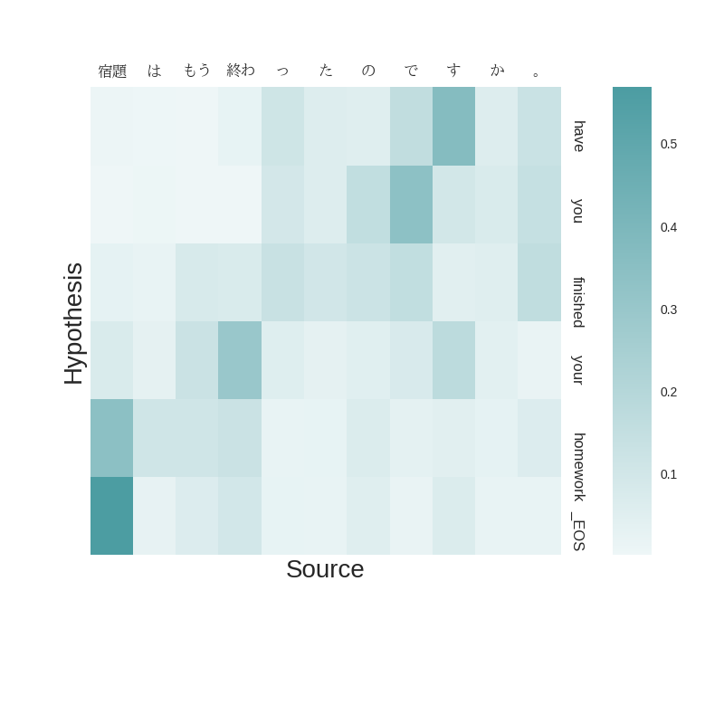

# Neural machine translation | Coursework 1

source: https://www.inf.ed.ac.uk/teaching/courses/mt/hw1.html

Your task is to implement a neural machine translation pipeline by extending a simple baseline model. In each part of the coursework you will be asked to implement a different extension.

**IMPORTANT**: Each extension will require you to train a completely new neural machine translation model from scratch. While implementing these changes may only take you a few minutes or hours, training the new models will take you **A LONG TIME**. You might implement something in thirty minutes and leave it to train overnight. Imagine that you return the next morning to find it has a bug! If the next morning is the due date, then you'll be in a pickle, but if it's a week before the due date, you have time to recover. So, if you want to complete this coursework on time, start early. I will not take pity on you if you start too late.

***

## Part 1: Getting started [20 marks]

To get started, you need to setup your virtual environment. If you do not already have Anaconda, install it now:

```bash
wget https://repo.continuum.io/miniconda/Miniconda3-latest-Linux-x86_64.sh
bash Miniconda3-latest-Linux-x86_64.sh
rm Miniconda3-latest-Linux-x86_64.sh
```

We will create a new environment called _mtenv_ (the commands will work with both Anaconda 2 and 3):

```bash
conda create --name mtenv python=3
source activate mtenv
conda install seaborn pandas matplotlib
pip install tqdm
pip install chainer
conda install ipython
conda clean -t
```

If you have access to a GPU, run `pip install cupy` before `pip install chainer` to enable CUDA support. You can leave the environment by running `source deactivate mtenv`.

Now get the code.

```bash
git clone https://github.com/ida-szubert/INFR11062
```

You’ll find a directory `data` containing English and Japanese parallel data (from [a tutorial](https://github.com/neubig/nmt-tips) that you may find helpful), a `model` directory containing a pretrained Japanese-to-English neural translation model, and three python files:

1. `nmt_config.py` contains configuration parameters, some of which you will be asked to experiment with. In particular, pay close attention to the model and training parameters towards the end of the file. You may also adjust the `gpuid` parameter if you have access to a GPU, which will make training times faster (but they will still take considerable time to train, so you should give yourself plenty of time even if you have a GPU).

2. `nmt_translate.py` trains a translation model (if one is not already present) and translates test sentences. You will not need to modify this script.

1. `enc_dec.py` contains a simple translation model, specified using the [chainer](http://docs.chainer.org/en/latest/) library. You will need to understand and modify this code as instructed below in order to complete the coursework. Doing so should give you a good idea of how a neural machine translation system works, at a level of detail that you can’t get from lectures or reading.

Run the following commands:

```bash
source activate mtenv

ipython
In [1]: %run nmt_translate.py
```

You should see a message indicating that a pre-trained model has been loaded. To translate using this model, do:

```bash
In [2]: _ = predict(s=10000, num=10)
```

This displays translations of the first 10 japanese sentences of the dev set. To view predictions on training set do:

```bash
In [3]: _ = predict(s=0, num=10)
```

Most of these translations will be poor. To find better translations from this model, we can add filters based on precision and recall of each translation with respect to a reference translation. The following statement will only display predictions with `recall >= 0.5`

```bash
In [4]: _ = predict(s=10000, num=10, r_filt=.5)  
```

The following statement will only display predictions with `precision >= 0.5`

```bash
In [5]: _ = predict(s=10000, num=10, p_filt=.5)
```

This model is still quite basic and trained on a small dataset, so the quality of translations is poor. Your goal will be to see if you can improve it.

The current implementation in `enc_dec.py` encodes the sentence using a bidirectional LSTM: one passing over the input sentence from left-to-right, the other from right-to-left. The final states of these LSTMs are concatenated and fed into the decoder, an LSTM that generates the output sentence from left-to-right. The _encoder_ is essentially the same as the encoder described in Section 3.2 of the [2014 paper](https://arxiv.org/pdf/1409.0473.pdf) that now forms the basis of most current neural MT models. The _decoder_ is simpler than the one in the paper (it doesn’t include the context vector described in Section 3.1), but you’ll fix that in Part 3.

Before we go deeply into modifications to the translation model, it is important to understand the baseline implementation, the data we run it on, and some of the techniques that are used to make the model run on this data.

**Q1\. [10 marks]** The file `enc_dec.py` contains explanatory comments to step you through the code. Five of these comments (A-E) are missing, but they are easy to find: search for the string `__QUESTION` in the file. A sixth comment (F) is missing from file `nmt_translate.py`. For each of these cases, please (1) add explanatory comments to the code, and (2) copy your comments to your answer file (we will mark the comments in your answer file, not the code, so it is vital that they appear there). If you aren’t certain what a particular function does, refer to the [chainer documentation](http://docs.chainer.org/en/latest/).(However, explain the code in terms of its effect on the MT model; don’t simply copy and paste function descriptions from the documentation).

In preparing the training data, word types that appear only once are replaced by a special token, _UNK. This prevents the vocabulary from growing out of hand, and enables the model to handle unknown words in new test sentences (which may be addressed by postprocessing).

**Q2\. [10 marks]** Examine the parallel data and answer the following questions.

1. Plot (choose sensible graphs) the distribution of sentence lengths in the English and Japanese and their correlation. What do you infer from this about translating between these languages?
2. How many word tokens are in the English data? In the Japanese?
3. How many word types are in the English data? In the Japanese data?
4. How many word tokens will be replaced by _UNK in English? In Japanese?
5. Given the observations above, how do you think the NMT system will be affected by differences in sentence length, type/ token ratios, and unknown word handling?

***

## Part 2: Exploring the model [30 marks]

Let’s first explore the decoder. It makes predictions one word at a time from left-to-right, as you can see by examining the function `decoder_predict` in the file `enc_dec.py`. Prediction works by first computing a distribution over all possible words conditioned on the input sentence. We then choose the most probable word, output it, add it to the conditioning context, and repeat until the predicted word is an end-of-sentence token (`_EOS`).

**Q3\. [10 marks]** Decoding

1.  Currently, the model implements greedy decoding, of always choosing the maximum-probability word at each time step. Can you explain why this might be problematic? Give language specific examples as part of your answer.
2.  How would you modify this decoder to do beam search—that is, to consider multiple possible translations at each time step. **NOTE**: You needn’t implement beam search. The purpose of this question is simply for you to think through and clearly explain how you would do it.
3.  Often with beam search (and greedy decoding), the decoder will output translations which are shorter than one would expect, as such length normalization is often used to fix this. Why does the decoder favour short sentences? What is a problem that length normalization can introduce?

The next two questions ask you to modify the model and retrain it. Implementing the modifications will not take you very long, but retraining the model will.

**NOTE**. I recommend that test your modifications by retraining on a small subset of the data (e.g. a thousand sentences). To do that, you should change the `USE_ALL_DATA` setting in `nmt_config.py` file to False. The results will not be very good; your goal is simply to confirm that the change does not break the code and that it appears to behave sensibly. This is simply a sanity check, and a useful time-saving engineering test when you’re working with computationally expensive models like neural MT. For your final models, you should train on the entire training set.

**Q4\. [10 marks]** MOAR layers!

1. Change the number of layers in the encoder = 2, decoder = 3\. Retrain the system.
2. Draw a diagram showing this new architecture (you may ignore the memory cell of the LSTM).
3. What effect does this change have on dev-set perplexity, BLEU score and the training loss (all in comparison to the baseline)? Can you explain why it does worse/better on the dev set than the baseline single layer model? (For reference, the baseline was trained for 12 epochs.) Can you explain why it does worse/better on the training set than the baseline? Is there a difference between the dev set and training set performance? Why is this case?

As a basis for your comparison, here are results for the baseline model (using chainer 3.4.0):

```txt
- dev set BLEU: 14.47
- dev set perplexity: 32.60
- average training set loss during last epoch: 4.68
```

You will get different results depending on your chainer version, and should report the version you use. Here are baseline results using chainer 1.24:

```txt
- dev set BLEU: 17.60
- dev set perplexity: 42.08
- average training set loss during last epoch: 3.58
```

To train a new model, you have to modify `nmt_config.py` with your required settings - the number of layers you wish to use, layer width, number of epochs and a name for your experiment.

As an example, let’s define a new model with the size of hidden units in the LSTM(s) as 100, and 2 layers for both the encoder and the decoder:

```python
# number of LSTM layers for encoder
num_layers_enc = 2
# number of LSTM layers for decoder
num_layers_dec = 2
# number of hidden units per LSTM
# both encoder, decoder are similarly structured
hidden_units = 100
```

And set the number of epochs equal 1 or more (otherwise the model will not train):

```python
# Training EPOCHS
NUM_EPOCHS = 10
```

To start training a model with updated parameters execute the bash script:

```bash
./run_exp.bat 
```

After each epoch, the latest model file is saved to disk. The model file name includes the parameters used for training. As an example, with the above settings, the model and the log file names will be:

```bash
model/seq2seq_10000sen_2-2layers_100units_{EXP_NAME}_NO_ATTN.model
model/train_10000sen_2-2layers_100units_{EXP_NAME}_NO_ATTN.log
```

**Q5\. [10 marks]** An important but simple technique for working with neural models is _dropout_, which must be applied in a particular way to our model. Implement the method of dropout described in [this paper](https://arxiv.org/pdf/1409.2329.pdf). This change should require no more than one or two lines, but will test your understanding of the code (because you need to identify where it should go).

Retrain you model.

1.  You should also explain where you added dropout to the code and what parameters you used for it.
2.  How does dropout affect the results, compared to the baseline? As in the previous question, your answer should explain the changes to perplexity and BLEU in the dev set, and training set loss.
3.  It is not always the case that both BLEU and perplexity improve. Sometimes BLEU improves and perplexity degrades or vice-versa. This is unexpected as they are both meant to measure the quality of the translations. Explain why this can happen.

***

## Part 3: Attention [50 marks]

The last change you will implement is to augment the encoder-decoder with an attention mechanism. For this, we expect you to use a very simple model of attention, _global attention with dot product_, as described in [this paper](http://www.aclweb.org/anthology/D15-1166). This is the simplest model of attention, and reasonably effective in many settings. As a practical matter, at each time step it requires you to take the dot product of the decoder hidden state with the hidden state of each input word (itself the concatentation of forward and backward encoder LSTM hidden states). The results should be passed through the _softmax_ function (i.e. exponentiated and normalized) and the resulting distribution should be used to interpolate the input hidden states to produce a context vector used as additional input to the decoder.

**Q6\. [20 marks]** Implement the attention model described above. You will find placeholders in the code to save the hidden states of the encoder and return an array of attention weights. Using this API will help ensure that your code works correctly.

**Q7\. [5 marks]** Retrain your decoder, and again explain how the change affects results compared to the baseline in terms of perplexity and BLEU on the dev set, and training set loss.

**Q8\. [10 marks]** Visualize the evolution of the attention vectors for five decoded sentences, using the provided code. Do they seem reasonable? Why or why not? Base your argument in evidence from the data. You’ll need to understand the Japanese words to do this effectively (use Google Translate). If the attention does not look reasonable, is it still a better translation than the baseline model? If it is, what does this say about attention?

We provide a function, `plot_attention` to plot attention vectors. A plot will be generated and stored in the model directory. To do this set `plot=True` in the `predict` function.

```
_ = predict(s=10000, num=1, plot=True)
```

This will output a heatmap of the attention vectors and save the plot as `model/sample_10000_plot.png`



**Q9\. [15 marks]** Where does attention help?

You should have seen that your BLEU and perplexity scores improved when using attention. Can you find any patterns in which type of source-target pairs this improvement is found?

1.  Come up with hypotheses of what type of source or/and target sentence benefit from attention. Give reasons for your hypothesis.
2.  Find evidence which tests this hypothesis. You may want to consider using perplexity on individual sentences within the dev set (however you may gather evidence any way you like).
3.  Evaluate your evidence, does it support your hypothesis? What does your evidence mean?